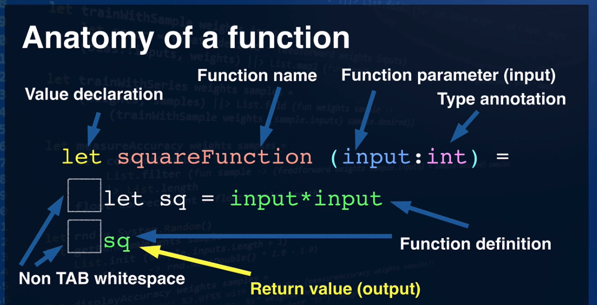

[[_TOC_]]

Books
* https://leanpub.com/essential-fsharp
*
These are the references Garrett used, in order, during his first 2 months of learning F#:

* About learning functional programming:
  * https://softwareengineering.stackexchange.com/questions/209357/from-a-high-level-programming-perspective-where-does-the-different-paradigm-b?rq=1
* Anatomy of a function
  * 
* A good demo app to explore:
  * https://github.com/SAFE-Stack/SAFE-BookStore
* Piping, in more detail:
  * http://theburningmonk.com/2011/09/fsharp-pipe-forward-and-pipe-backward/
* Concurrent tasks:
  * https://fsharpforfunandprofit.com/posts/concurrency-async-and-parallel/
* Discriminated Unions:
  * https://docs.microsoft.com/en-us/dotnet/fsharp/language-reference/discriminated-unions
  * These have no equivalent in Typescript, Javascript, Perl, Python, or C++, as far as I can tell.
  * I suspect F# derives a lot of its uniqueness from these.
* Microsoft is incredibly lacking in basic examples for F#.
  * Here’s their docs for Dictionary - a pretty essential data manipulation structure:
    * https://msdn.microsoft.com/en-us/library/kw5aaea4.aspx
  * No F# example code anywhere??
  * Why is Microsoft so bad at writing documentation, even after 45 years?
  * Here’s tutorialspoint on F# Dictionaries:
    * https://www.tutorialspoint.com/fsharp/fsharp_mutable_dictionary.htm
  * Better, but still just about nothing for examples
  * Ah, finally some code:
  * https://stackoverflow.com/questions/20335404/f-function-like-list-find-but-search-for-any-of-a-dictionarys-keys
* More on function composition:
  * https://fsharpforfunandprofit.com/posts/conciseness-functions-as-building-blocks/
* Clarifying the use of async.Return:
  * https://stackoverflow.com/questions/2343510/type-mismatch-with-async-in-f
* Why is ‘yield’ scattered seemingly indiscriminately through the react keywords in the SAFE Bookstore front end?
  * https://stackoverflow.com/questions/10206199/do-yield-in-for-loop-within-sequence-computation-expression
  * Answer: Using yield forces the emit of a list, which is what you need to encapsulate two sibling elements in HTML.
* React fable syntax has a bunch of code to translate between HTML attributes and F sharp keywords.
  * https://github.com/fable-compiler/fable-react/blob/master/Fable.Import.React.fs
  * This translation layer is to get HTML code showing up alongside fsharp in the same file so it can be programmatically constructed.
  * It’s as elegant as turkey in a wetsuit trying to play basketball.
  * But this is the price we pay to gain distance from the biiig scaaaary world of raw HTML/CSS.
    * Wooooo oooo ooo scary!
* Dates and date formatting:
  * http://www.fssnip.net/s/title/Friendly-date-formatting
* Using ‘not’ in FSharp:  Pipe it.
  * https://stackoverflow.com/questions/4418892/f-if-not-condition
* A little bit of info about ‘of’ and what it’s for:
  * https://stackoverflow.com/questions/23153556/f-type-definition-using-of-keyword
  * https://docs.microsoft.com/en-us/dotnet/fsharp/language-reference/pattern-matching
* Cheat sheet for basic F# math:
  * https://www.dotnetperls.com/math-fs
* FSharp supports else if as elif.  Hooray!
  * https://docs.microsoft.com/en-us/dotnet/fsharp/language-reference/conditional-expressions-if-then-else
* FSharp sequences, which are what you get when you (for example) iterate over a Dictionary:
  * https://msdn.microsoft.com/en-us/visualfsharpdocs/conceptual/collections.seq-module-%5Bfsharp%5D
* Handy sample code:
  * https://learnxinyminutes.com/docs/fsharp/
* Source for Fable’s Browser framework, for interacting with client browsers
  * https://github.com/fable-compiler/fable-import/blob/master/Browser/Fable.Import.Browser.fs
* Definition of HTMLElement:
  * https://github.com/fable-compiler/fable-import/blob/master/Browser/Fable.Import.Browser.fs#L3032
* Definition of HTMLInputElement:
  * https://github.com/fable-compiler/fable-import/blob/master/Browser/Fable.Import.Browser.fs#L3790
* HTMLElement to HTMLInputElement : use the “downcast” operator
  * https://stackoverflow.com/questions/31616761/f-casting-operators
* A bit of clarity about interfaces and inheritance:
  * https://docs.microsoft.com/en-us/dotnet/fsharp/language-reference/interfaces
* Handy builtin:  List.max for finding the maximum value in a list
  * https://msdn.microsoft.com/en-us/visualfsharpdocs/conceptual/list.max%5B%27t%5D-function-%5Bfsharp%5D
* The rec keyword:  It has to do with type checking:
  * https://stackoverflow.com/questions/900585/why-are-functions-in-ocaml-f-not-recursive-by-default
* Some handy reference code on various ways to fold/unfold lists:
  * https://stackoverflow.com/questions/31595184/f-iterate-over-collection-and-build-list
* F# Printf formatting:
  * https://fsharpforfunandprofit.com/posts/printf/
* Symbol and operator reference:
  * https://docs.microsoft.com/en-us/dotnet/fsharp/language-reference/symbol-and-operator-reference/
* Map: Alternative to Dictionaries when you don’t intend for it to be mutable.
  * https://msdn.microsoft.com/visualfsharpdocs/conceptual/collections.map%5b%27key%2c%27value%5d-class-%5bfsharp%5d
* Map.ofList: One of several ways to easily build a Map from some other data structure.
  * https://msdn.microsoft.com/en-us/visualfsharpdocs/conceptual/map.oflist%5B%27key%2C%27t%5D-function-%5Bfsharp%5D
* This leads immediately to the question: Dictionary vs Map?  Which is appropriate when?
  * https://stackoverflow.com/questions/29077352/f-difference-between-dictionary-hashtable-and-map
* Working with Maps (and sets) :
  * https://en.wikibooks.org/wiki/F_Sharp_Programming/Sets_and_Maps
* A little help concatenating strings:
  * https://stackoverflow.com/questions/43552202/concat-in-fsharp-core-string-vs-concat-in-system-string
* Combining map with filter, and don’t want to run the same code?  Use choose:
  * https://msdn.microsoft.com/en-us/visualfsharpdocs/conceptual/list.choose%5B%27t,%27u%5D-function-%5Bfsharp%5D
* Want to return an object, as well as convey whether that object was found?  Use Some/None
  * https://stackoverflow.com/questions/2983242/f-how-to-return-have-value-a-tuple-or-null
* Returning ‘unit’:  Why did it take so long to encounter this?
  * https://stackoverflow.com/questions/18095978/how-to-return-unit-from-an-expressions-in-f
* Maximum value of a list plus one?  Dump it into max! (tempdict.Values |> Seq.max) + 1
  * https://msdn.microsoft.com/en-us/visualfsharpdocs/conceptual/list.max%5B%27t%5D-function-%5Bfsharp%5D
    * Screw you, Big-O efficiency!!
* Using List.pick to get the first single matching item from a list:
  * https://stackoverflow.com/questions/11335583/applying-a-filter-to-get-a-single-item-and-using-the-filter-function-to-transfor
* You sometimes have to translate between Nullable and Option when dealing with databases
  * http://bugsquash.blogspot.com/2010/09/nullable-in-f.html
* Full textbook "Expert F# 3rd Edition"
  * https://the-eye.eu/public/Books/IT%20Various/expert_f_3.0_3rd_edition.pdf
* DateTime arithmetic (It's for C# but is equivalent to F#)
  * https://docs.microsoft.com/en-us/dotnet/api/system.datetime.op_subtraction?view=netframework-4.8