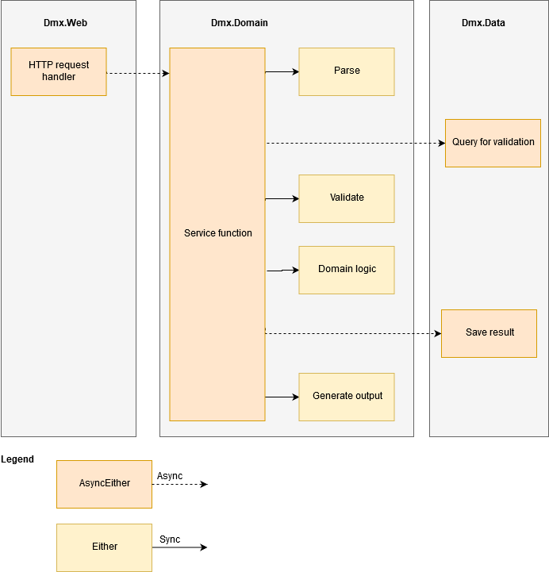

* OUTDATED *

[[_TOC_]]

Our code base can be a little overwhelming on first encounter.

In addition to just the normal range of programming styles and contexts we are using a number of computational builders from F sharp to introduce other control flow patterns.  For example we use the F sharp task pattern in places where operations are likely to have an extended wait on an external resource (typically network or disk//database). Although the code still appears to execute in a linear fashion, the entire task construct defines an operation that can be executed later, and during execution may be doing much more complicated operations under the hood than is apparent from the linear code. 

You might be familiar with the async computation expression. We use task instead (and have logic around Tasks and TaskEithers in our Demetrix-maintained package Plough.ControlFlow). Tasks, unlike async (which we used to use) are greedy however - they might start execution at any point (whereas asyncs are delayed), meaning they have to be treated slightly differently

```fsharp
 let send ofJsonResponse relativeUrl fetch: TaskEither<'response> =
        task {
            try
                // match bang(!) here runs the fetch operation asynchronously and matches on the result
                match! fetch relativeUrl with
                | Ok data -> return ofJsonResponse data
                | Error err ->
                    let problemDecoder = Decode.Auto.generateDecoder<ProblemReport>()
                    // return emits the final result of the builder 
                    return ofJson problemDecoder (problemReportToFailure >> fail) err
            with
            | e ->
                return sprintf "Call to %s failed. Ex: \n %A" relativeUrl e
                       |> exn |> FailureMessage.ExceptionFailure |> fail
        }
```

The F sharp computational expressions greatly simplify the interaction with asynchronous Apis. The equivalent C# was historically more complicated with explicit callbacks and delegates, although that language has recently been acquiring simpler syntax.

This is a basic overview of the different computational builders we are using in the code base, and the pros and cons of each

# Asynchronous Code

At a high level, async/task constructs allow both deferred execution (we can define a workflow and then execute it later), makes more efficient use of threads during I/O, and has syntactically simpler interactions with Apis that are inherently asynchronous.  In general, when a process calls an API that can result in a delay (for a network call, 200 ms is an eternity, for a user, a task that computes for 20 seconds is a long delay), we have three concerns as developers:

1. We wish the process to continue in a responsive fashion from a user point of view
2. We want to make efficient use of CPU resources in the meantime, and possibly most importantly 
3. We want to stay sane writing the actual code. 

In order to allow the app to do two things at once, we take advantage of threads. These allow multiple points of execution within an application. An application may have many concurrent threads. A thread is still a relatively heavy weight construct.  Applications still share threads where possible via ThreadPooling, since starting and stopping them is expensive, so they may be kept in a pool. When a thread encounters an operation that can result in a long delay, the thread is effectively stopped and is unusable by other tasks. 

An asynchronous API allows *thread sharing*. Once an operation is encountered that will block further execution, the thread can be efficiently given to another task, and returns once the awaited operation responds (e.g. the disc is ready to return information or we receive a reply over the network). From an API point of view, this is often expressed as a callback. You call the operation to request a web download and specify a function to be called when that operation completes. This continuation style programming is somewhat ugly in practice, bring us to our third point. Writing elegant asynchronous code that allows thread reuse is usually tedious. 

The task computational expression enables us to write the code in a fairly dumb synchronous style and yet to get all of the benefits of asynchronous communication. There is a tiny overhead due to the internals of computational expressions, but it is minuscule compared with the efficiency of being able to re-purpose threads. These performance considerations typically kick in when you have many users of a Web server, e.g. 100,000 requests per second. You obviously can't create 100,000 threads, so thread reuse makes a big deal. It won't speed up a single request versus complete synchronously execution (in fact it might make things a tiny bit slower), but we will almost certainly encounter bursts of use where we benefit slightly.

As a potential drawback, asynchronous coding can sometimes be slightly counter-intuitive when you are monitoring execution. For example function calls might return before you expect (leaving an activity to happen in the background), or print after you are expecting something to happen. Synchronous execution is definitely the easiest pattern to reason about as a human, but the world is typically not synchronous unfortunately. 

We will encounter mandatory asynchronous interactions with the basic giraffe infrastructure (via tasks), hang fire (which takes asynchronous code for background jobs) and web operations. It's common in file tasks (e.g. watching folders), but there are often synchronous file loading operations so you are not forced to interact with asynchronous operations.

* [FSharp for fun and profit intro to async and parallel](https://fsharpforfunandprofit.com/posts/concurrency-async-and-parallel/)
* [Official Microsoft intro FSharp async and parallel]( https://docs.microsoft.com/en-us/dotnet/fsharp/tutorials/asynchronous-and-concurrent-programming/async)
* [Intro to async and tasks in .Net in general]( https://docs.microsoft.com/en-us/dotnet/csharp/programming-guide/concepts/async/task-asynchronous-programming-model)
* [Plough Repo](https://github.com/demetrixbio/Plough.ControlFlow)

# Synchronous code

This is the default mode if we aren't using any fancy constructs. It's almost impossible to write perfectly synchronous code, because most of the IO Apis are explicitly asynchronous. We can force an obligatory async process to be synchronous using Task.RunSynchronously but this is slightly tedious from a coding point of view and also adds some overhead for the underlying thread infrastructure synchronising different activities. In a traditional user facing application, having everything synchronous leads to a poor user experience (typically a window that is frozen until some background task completes). We don't encounter that much in our application world because the browser is inherently asynchronous and the Web server can also do many things in parallel by design, but in general asynchronous code will lead to a better user experience by enabling interactive activities to continue while waiting.


# Tasks

The British have some of the worst plumbing in the developed world by virtue of having invented a lot of it and then never upgrading. The F sharp community were pioneers with asynchronous constructs, but as the C# community catches up, they are adopting standards that are similar to but different from the F sharp versions. For example the task construct is being used for capturing background asynchronous operations and is now baked into a lot of C# infrastructure (e.g. hang fire, asp.net core). The ideal medium term outcome is that the F sharp community adopts the.net standard operation (i.e. the task), so I would predict that we eventually end up using tasks more widely in the code. At the moment we are forced in a few boundary areas to interact with tasks, and there are ongoing discussions about more natively integrating them into the F sharp language. E.g.

* [Great discussion on FSharp lang feature addressing performance and debugging issues with tasks and async](https://github.com/fsharp/fslang-suggestions/issues/581)
* [Current F# lang feature going to RFC](https://github.com/dotnet/fsharp/pull/6811)
* [Original giraffe discussion of the issue task vs async](https://github.com/giraffe-fsharp/Giraffe/issues/53)
* [Shorter term addressing of issue in giraffe](https://github.com/giraffe-fsharp/Giraffe/pull/75)


Since those are not resolved, the proposal is that we stick with something like async builders in the interim which should be relatively painless to convert tasks once the standard settles. I believe a lot of the giraffe examples are already basically written as tasks, so that approach works. Like synchronous/asynchronous code in F sharp, it's possible but tedious to interact and swap between tasks and async. There are helper functions like async.AsTask but I have found it harder interacting between synchronous and tasks. Like asynchronous there is a handy computational expression builder for writing tasks that looks a lot like async.   It's not built into F sharp but we have incorporated an open source implementation into our code base.

## Task returning either pattern

[Background on the Tasks computational builder](https://github.com/rspeele/TaskBuilder.fs#whats-the-deal-with-the-v2-module)

```fsharp
open FSharp.Control.Tasks.V2

task {
    let! response = protectedHttpClient.GetAsync(webApiUrl)

    return!
        if response.IsSuccessStatusCode then
            task {
                let! text = response.Content.ReadAsStringAsync()
                return succeed text
            }

        else
            task {
                let! content = response.Content.ReadAsStringAsync() 
                let error = JsonExamples.APIError.Parse content
                return sprintf "statuscode=%A message=%s" response.StatusCode error.Error.Message |> NotFound |> fail
            }
} 
```

## Longish (abbreviated) example showing interaction with infrastructure requiring tasks

```fsharp
let runSpreadsheetDownload() =
    let log (s:string)  =
        printfn "barcodespreadsheet: %s  %s" (System.DateTime.Now.ToLongTimeString()) s
        
    taskEither{
        // get current spreadsheet path from settings store
        let! itemPathSetting = SettingsService.getSettingByKey Literals.BarcodeImport.BarcodeSpreadsheetPath
                    
        ...

        // get spreadsheet
        let! parsedSpreadsheetData = import log credentials itemPath
        
        // grab a db connection and transaction
        use! connection = Db.openConnection() 
        use scope = Db.createTransactionScope()
        
        if checkSpreadsheetUnchanged itemPath parsedSpreadsheetData.Updated then
            ...
        else
            // ensure spreadsheet entry exists in db
            match upsertSpreadsheet itemPath parsedSpreadsheetData.Spreadsheet parsedSpreadsheetData.Updated with
            | None ->
                ...
                return ()   // exiting computation expression
            | Some spreadsheetDbId ->
                
                ...
                
                /// don't deal with rows that occur more than once
                let duplicatedRows =
                    parsedSpreadsheetData.Rows
                    |> Array.groupBy (fun row -> row.Barcode)
                    |> Array.choose (fun (barcode,rows) -> if rows.Length>1 then Some barcode else None)
                    |> Set.ofArray
                    
               ...
                
             ...

    }

```
# Either


The either builder is an orthogonal construct that enables us to do more sophisticated error handling without needing to worry about every operation failing and short-circuiting execution. In conventional programming models, every call can fail, typically resulting in huge piles of nested else statements, unclear flow of control and in the end abdication by the programmer for reporting and passing back error messages. The either (monad, shhhh) re-formulates every call as either returning a result or an error and provides a way to combine many functions together so that errors pass seamlessly and reasonably invisibly through the flow. Unfortunately the classic implementation of the style of programming is to chain a huge pipeline of functions together with secure fish operators which can reduce readability. The alternative is to use an F sharp computational expression which hides much of the plumbing, just leaving the happy/preferred path visible in the code, with errors being handled in the background. This is relatively efficient from a coding point of view (the type signatures get a little gnarly), quite efficient from an execution point of view (there is always some overhead from error handling but it's minimal), and if you have enough helper functions to convert all of the typical edge cases (where you interact with other infrastructure that doesn't use this pattern), it can be reasonably easy to read. Any calls to some sort of logic that has specific error/validation/etc cases that don't involve a db (or other async-by-necessity) call should be eithers. 

# TaskEither

In practice we often want to combine asynchronous patterns and the either pattern, so this builder implements both. It interacts nicely with underlying asynchronous API calls (e.g. web retrieval, creating background tasks for running jobs, longer running file I/O, tasks that wait on operating system events like file watching), and also has the principled error handling that we like in the either pattern. Our in-house package Plough has implemented this using Tasks rather than Asyncs.

It suffers from the same issues that all computational expressions currently have in F sharp (the underlying continuations that are built by the computational expression confuse the hell out of the debugger and things appear to execute in strange orders, trace backs are much more complex and variables may not be defined as local values in the same way as pure non-computational expression code). To be clear though this is a general problem with any of the builders, and not specific to async or taskEither.  The trade-off of being able to write relatively straightforward code with error handling taking care of and async interactions being simple assignments seems worth it. We still need to interact with task infrastructure, because hang fire and giraffe use those as their default constructs, but there are easy into conversions between async style operations and tasks. Stacking either on top just means that we return success/fail types and have operators for combining sequences of events or parallel events. It is anticipated in the long run that we would probably end up settling on something like a TaskEither style construct once the F sharp native support for tasks catches up, but they should be very similar in syntax making the conversion easy.

# What do I use where?

On the outer levels of the back-end stack, the interactions with giraffe are all tasks, but we have mostly managed to hide those, so you can write taskEither or either constructs without noticing the tasks. You will need tasks if you are submitting jobs to hang fire, and potentially interacting with certain.net Apis (I encountered this talking with SharePoint for example, just reinforcing the idea that the rest of the.net world is embracing tasks).

It's okay to use either as well for anything that doesn't require asynchronous action - these can be converted within a taskEither computation expression with a let!. 

We have a standing decision to keep the either pattern out of the database (data) layer. The reasoning here is that the database operations a very simple in nature (typically returning data or not), and a simple option will suffice. In the event of a dramatic unexpected error, there is very very little chance anything further up the stack can overcome the issue, so reporting a database error is a relatively meaningless task. If people really do want to catch database errors they can still use exceptions. Typically the result of the database layer is adapted into the either pattern at the next level (service layer), with functions like TaskEither.isSome.

This diagram shows the current patterns of using `either` and `taskEither` (just replace asyncEither with TaskEither) in the code:
